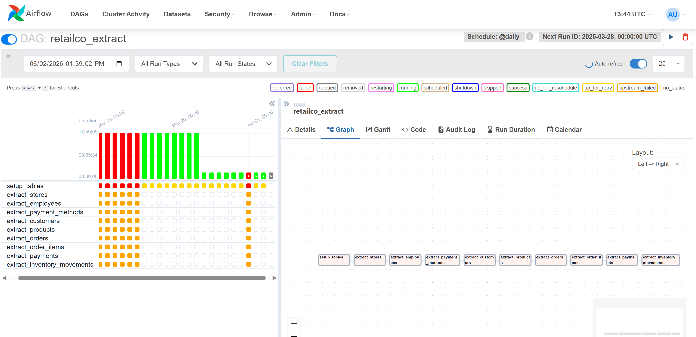

# RetailCo Data Platform

**Team F | HNG Stage 8 | Data Engineering Pipeline**

---

## Overview

RetailCo is a Nigerian retail chain operating stores in Lagos, Abuja, Port Harcourt, and Kano. This project builds the company's complete data platform from scratch — extracting data from a legacy ERP system, loading it into a data warehouse, transforming it into analytics-ready Kimball dimensional models, and orchestrating the entire pipeline on a daily automated schedule.

The platform answers five management questions every week:
- Revenue performance across stores, products, and categories
- Customer behaviour, purchase frequency, and average order value
- Product and discount analysis with margin impact
- Payment channel insights and anomaly detection
- Operational data quality monitoring

---

## Architecture

```
ERP API (Heroku) — 9 entities
      ↓  Python extractor
      ↓  Sequential extraction + watermark per entity
      ↓  Retries on 429 and 500 + exponential backoff
Lake PostgreSQL — schema: raw (port 5435)
      ↓  dlt incremental pipeline
Warehouse PostgreSQL — schema: raw (port 5436)
      ↓  dbt staging models (cast + rename + filter soft deletes)
Warehouse PostgreSQL — schema: staging
      ↓  dbt snapshots (SCD2 for customers + products)
      ↓  dbt mart models (dimensions + facts)
Warehouse PostgreSQL — schema: raw_marts
```


All components run inside Docker containers and are orchestrated by Apache Airflow 2.9.0 on a daily schedule.

---
## Incremental Processing

The platform avoids full reloads.

Layer 1: Extractor
- Stores entity-level watermarks
- Calls ERP API with updated_after timestamps

Layer 2: dlt
- Tracks source_updated_at cursor
- Loads only changed records

Layer 3: dbt Snapshots
- Detects attribute changes
- Maintains historical versions of customers and products
---
## Tools and Versions

| Layer | Tool | Version |
|---|---|---|
| Extraction | Python 3.11+ | Hand-written extractor |
| Lake Storage | PostgreSQL 17 | Port 5435 |
| Loading | dlt 1.6.1+ | Incremental pipeline |
| Warehouse Storage | PostgreSQL 17 | Port 5436 |
| Transformation | dbt-core + dbt-postgres | 1.7+ |
| Orchestration | Apache Airflow | 2.9.0 |
| Containerisation | Docker + Docker Compose | Latest |

---

## Project Structure

```
RetailCo-Data-Platform-HNG-Stage-8_TeamF/
├── design/                              # CP1: Design artifacts
│   ├── RetailCo_Architectural Diagram.pdf
│   ├── RetailCo_Raw_ERD.pdf
│   ├── RetailCo_bus_matix.pdf
│   └── RetailCo_warehouse_ERD.pdf
├── extractor/                           # CP2: Python ERP extractor
│   ├── __init__.py
│   ├── api_client.py
│   ├── cp2_extract_dag.py
│   ├── erp_extractor.py
│   ├── extract.py
│   ├── loader.py
│   ├── paginator.py
│   ├── watermark.py
│   └── requirements.txt
├── dlt_pipeline/                        # CP3: dlt incremental merge pipeline using source_updated_at cursor
│   ├── pipeline.py
│   └── requirements.txt
├── dbt_project/                         # CP4: Kimball dimensional models
│   ├── dbt_project.yml
│   ├── packages.yml
│   ├── models/
│   │   ├── staging/
│   │   │   ├── sources.yml
│   │   │   ├── schema.yml
│   │   │   ├── stg_customers.sql
│   │   │   ├── stg_products.sql
│   │   │   ├── stg_orders.sql
│   │   │   ├── stg_order_items.sql
│   │   │   ├── stg_payments.sql
│   │   │   ├── stg_stores.sql
│   │   │   ├── stg_employees.sql
│   │   │   ├── stg_payment_methods.sql
│   │   │   └── stg_inventory_movements.sql
│   │   └── marts/
│   │       ├── dimensions/
│   │       │   ├── schema.yml
│   │       │   ├── dim_date.sql
│   │       │   ├── dim_customer.sql
│   │       │   ├── dim_product.sql
│   │       │   ├── dim_store.sql
│   │       │   ├── dim_employee.sql
│   │       │   └── dim_payment_method.sql
│   │       └── facts/
│   │           ├── schema.yml
│   │           ├── fct_sales.sql
│   │           ├── fct_payments.sql
│   │           ├── fct_inventory_daily.sql
│   │           ├── fct_order_lifecycle.sql
│   │           └── flagged_payments.sql
│   └── snapshots/
│       ├── dim_customer_snapshot.sql
│       └── dim_product_snapshot.sql
├── airflow/
│   ├── docker-compose-airflow.yml
│   └── dags/
│       ├── extract_dag.py               # Extraction only DAG
│       └── retailco_pipeline_dag.py     # Full master pipeline DAG
├── docker/
│   ├── lake_init.sql
│   └── warehouse_init.sql
├── docker-compose.yml
└── README.md
```

---

## Kimball Bus Matrix

| Fact Table | Grain | dim_date | dim_customer | dim_product | dim_store | dim_employee | dim_payment_method |
|---|---|:---:|:---:|:---:|:---:|:---:|:---:|
| fct_sales | One row per order line | ✓ | ✓ SCD2 | ✓ SCD2 | ✓ | ✓ | — |
| fct_payments | One row per payment | ✓ | ✓ SCD2 | — | ✓ | — | ✓ |
| fct_inventory_daily | Product × store × day | ✓ | — | ✓ SCD2 | ✓ | — | — |
| fct_order_lifecycle | One row per order | ✓ | ✓ SCD2 | — | ✓ | ✓ | — |

**Note:** `flagged_payments` is a data quality artifact. It is NOT a fact table and does not appear in the bus matrix.

---

## Setup Instructions

### Prerequisites
- Docker Desktop installed and running
- Python 3.11+
- Git

### Step 1: Clone the repository
```bash
git clone https://github.com/R887645/RetailCo-Data-Platform-HNG-Stage-8_TeamF.git
cd RetailCo-Data-Platform-HNG-Stage-8_TeamF
```

### Step 2: Create environment file
Create a `.env` file in the root folder with the following variables:
```
ERP_BASE_URL=https://hngstage8da-55c7f5f769c8.herokuapp.com
ERP_API_KEY=your_api_key_here
LAKE_HOST=localhost
LAKE_PORT=5435
LAKE_DB=retailco_lake
LAKE_USER=postgres
LAKE_PASSWORD=postgres
WAREHOUSE_HOST=localhost
WAREHOUSE_PORT=5436
WAREHOUSE_DB=retailco_warehouse
WAREHOUSE_USER=postgres
WAREHOUSE_PASSWORD=postgres
```

### Step 3: Start the databases
```bash
docker-compose up -d
```

Verify containers are running:
```bash
docker ps
```

You should see:
```
retailco_lake        Up    0.0.0.0:5435->5432/tcp
retailco_warehouse   Up    0.0.0.0:5436->5432/tcp
```

### Step 4: Start Airflow
```bash
cd airflow
docker-compose -f docker-compose-airflow.yml up -d
```

Wait 60 seconds then verify:
```bash
docker ps
```

You should see:
```
airflow_webserver    Up    0.0.0.0:8080->8080/tcp
airflow_scheduler    Up
airflow_db           Up
```

### Step 5: Access Airflow UI
```
URL:      http://localhost:8080
Username: admin
Password: admin
```

---

## How to Run the Pipeline

## Airflow Pipeline

The complete RetailCo platform is orchestrated using Apache Airflow.

Execution sequence:

Extract
→ dlt Load
→ dbt Snapshot
→ dbt Staging
→ dbt Marts
→ dbt Tests



### Option 1: Airflow UI (recommended)
1. Open `http://localhost:8080`
2. Find the DAG called `retailco_master_pipeline`
3. Toggle it **ON**
4. Click **▶ Trigger DAG** to run immediately

### Option 2: Command line
```bash
docker-compose exec airflow_scheduler \
  airflow dags trigger retailco_master_pipeline
```

### Option 3: Backfill historical data
```bash
docker-compose exec airflow_scheduler \
  airflow dags backfill retailco_master_pipeline \
  --start-date 2025-01-01 \
  
```

---

## DAG Task Order

The master pipeline DAG (`retailco_master_pipeline`) runs all tasks in strict sequential order:

```
setup_tables
      ↓
extract_stores
      ↓
extract_employees
      ↓
extract_payment_methods
      ↓
extract_customers
      ↓
extract_products
      ↓
extract_orders
      ↓
extract_order_items
      ↓
extract_payments
      ↓
extract_inventory_movements
      ↓
dlt_load
      ↓
dbt_snapshot
      ↓
dbt_staging
      ↓
dbt_marts
      ↓
dbt_test
```

Every task has 2 retries with a 5-minute delay and exponential backoff.
Failure at any task stops all downstream tasks automatically.

## Data Quality

dbt tests validate:

- Primary key uniqueness
- Non-null business keys
- Referential integrity
- Positive sales quantities
- Valid order lifecycle statuses
- Inventory stock consistency
- Payment quality rules

Current Result:

106 / 106 tests passing
---

## How to Query the Warehouse

Connect using pgAdmin, DBeaver or any SQL client:
```
Host:     localhost
Port:     5436
Database: retailco_warehouse
User:     postgres
Password: postgres
Schema:   raw_marts
```

### Question 1 — Revenue Performance
```sql
-- Revenue by store
SELECT
    ds.store_name,
    ds.city,
    ROUND(SUM(fs.net_amount), 2)          AS total_revenue,
    COUNT(DISTINCT fs.order_id)            AS total_orders
FROM raw_marts.fct_sales fs
JOIN raw_marts.dim_store ds
    ON ds.store_sk = fs.store_sk
GROUP BY ds.store_name, ds.city
ORDER BY total_revenue DESC;

-- Revenue by category over time
SELECT
    dd.year,
    dd.month,
    dd.month_name,
    dp.category,
    ROUND(SUM(fs.net_amount), 2)          AS total_revenue
FROM raw_marts.fct_sales fs
JOIN raw_marts.dim_product dp
    ON dp.product_sk = fs.product_sk
JOIN raw_marts.dim_date dd
    ON dd.date_key = fs.date_key
WHERE dp.is_current = true
GROUP BY dd.year, dd.month, dd.month_name, dp.category
ORDER BY dd.year, dd.month, total_revenue DESC;

-- Top 10 products by revenue
SELECT
    dp.product_name,
    dp.category,
    ROUND(SUM(fs.net_amount), 2)          AS total_revenue,
    SUM(fs.quantity)                       AS total_units_sold
FROM raw_marts.fct_sales fs
JOIN raw_marts.dim_product dp
    ON dp.product_sk = fs.product_sk
WHERE dp.is_current = true
GROUP BY dp.product_name, dp.category
ORDER BY total_revenue DESC
LIMIT 10;
```

### Question 2 — Customer Behaviour
```sql
SELECT
    dc.segment,
    COUNT(DISTINCT fs.order_id)            AS total_orders,
    COUNT(DISTINCT dc.customer_id)         AS unique_customers,
    ROUND(COUNT(DISTINCT fs.order_id)::numeric /
          COUNT(DISTINCT dc.customer_id), 1)
                                           AS avg_orders_per_customer,
    ROUND(SUM(fs.net_amount) /
          COUNT(DISTINCT fs.order_id), 2)  AS avg_order_value,
    ROUND(SUM(fs.net_amount), 2)           AS total_revenue,
    ROUND(SUM(fs.net_amount) /
          COUNT(DISTINCT dc.customer_id), 2)
                                           AS avg_revenue_per_customer
FROM raw_marts.fct_sales fs
JOIN raw_marts.dim_customer dc
    ON dc.customer_sk = fs.customer_sk
WHERE dc.is_current = true
GROUP BY dc.segment
ORDER BY total_revenue DESC;
```

### Question 3 — Product and Discount Analysis
```sql
-- Top 10 products by margin
SELECT
    dp.product_name,
    dp.category,
    SUM(fs.quantity)                       AS units_sold,
    ROUND(SUM(fs.gross_amount), 2)         AS gross_revenue,
    ROUND(SUM(fs.discount_amount), 2)      AS total_discount,
    ROUND(SUM(fs.margin_amount), 2)        AS total_margin,
    ROUND(SUM(fs.margin_amount) /
          SUM(fs.gross_amount) * 100, 1)   AS margin_pct
FROM raw_marts.fct_sales fs
JOIN raw_marts.dim_product dp
    ON dp.product_sk = fs.product_sk
WHERE dp.is_current = true
GROUP BY dp.product_name, dp.category
ORDER BY total_margin DESC
LIMIT 10;

-- Discount analysis by category
SELECT
    dp.category,
    ROUND(AVG(fs.discount_amount), 2)      AS avg_discount,
    ROUND(SUM(fs.discount_amount), 2)      AS total_discount,
    ROUND(SUM(fs.discount_amount) /
          SUM(fs.gross_amount) * 100, 1)   AS discount_pct
FROM raw_marts.fct_sales fs
JOIN raw_marts.dim_product dp
    ON dp.product_sk = fs.product_sk
WHERE dp.is_current = true
GROUP BY dp.category
ORDER BY discount_pct DESC;
```

### Question 4 — Payment Channel Insights
```sql
--Which payment methods experience the most refunds.
SELECT
    pm.payment_method_name,
    pm.provider,
    pm.is_digital,
    COUNT(f.payment_sk) AS total_transactions,
    ROUND(
        COUNT(f.payment_sk)::NUMERIC /
        SUM(COUNT(f.payment_sk)) OVER () * 100,
2
    ) AS transaction_share_pct,
    ROUND(
        SUM(f.amount_paid)::NUMERIC,
2
    ) AS total_amount_collected,
    ROUND(
        SUM(f.amount_paid)::NUMERIC /
        SUM(SUM(f.amount_paid)) OVER () * 100,
2
    ) AS revenue_share_pct,
    ROUND(
        AVG(f.amount_paid)::NUMERIC,
2
    ) AS avg_payment_amount,
    COUNT(
        CASE
            WHEN f.is_refund = TRUE THEN 1
        END
    ) AS refund_count,
    ROUND(
        SUM(
            CASE
                WHEN f.is_refund = TRUE
                THEN ABS(f.amount_paid)
                ELSE 0
            END
        )::NUMERIC,
2
    ) AS total_refund_amount,

    RANK() OVER (
        ORDER BY SUM(f.amount_paid) DESC
    ) AS revenue_rank

FROM raw_marts.fct_payments f
JOIN raw_marts.dim_payment_method pm
    ON f.payment_method_sk = pm.payment_method_sk

GROUP BY
    pm.payment_method_name,
    pm.provider,
    pm.is_digital

ORDER BY total_amount_collected DESC;

-- Payment method breakdown
SELECT
    dpm.payment_method_name,
    dpm.is_digital,
    COUNT(*)                               AS payment_count,
    ROUND(SUM(fp.amount_paid), 2)          AS total_amount,
    SUM(CASE WHEN fp.is_refund
        THEN 1 ELSE 0 END)                 AS refund_count,
    COUNT(*) * 100.0 /
        SUM(COUNT(*)) OVER ()              AS pct_of_payments
FROM raw_marts.fct_payments fp
JOIN raw_marts.dim_payment_method dpm
    ON dpm.payment_method_sk = fp.payment_method_sk
GROUP BY dpm.payment_method_name, dpm.is_digital
ORDER BY total_amount DESC;

-- Flagged payment anomalies
SELECT
    reason,
    COUNT(*)                               AS flagged_count,
    ROUND(SUM(amount_paid), 2)             AS total_amount
FROM raw_marts.flagged_payments
GROUP BY reason
ORDER BY flagged_count DESC;
```

### Question 5 — Operational Data Quality
```sql
-- Flagged payments summary
SELECT
    reason,
    COUNT(*)                               AS total_flagged,
    ROUND(SUM(ABS(amount_paid)), 2)        AS total_amount_at_risk
FROM raw_marts.flagged_payments
GROUP BY reason
ORDER BY total_flagged DESC;

-- Order lifecycle health
SELECT
    current_status,
    COUNT(order_id)                        AS order_count,
    ROUND(AVG(lifecycle_days), 1)          AS avg_lifecycle_days,
    MIN(lifecycle_days)                    AS min_days,
    MAX(lifecycle_days)                    AS max_days
FROM raw_marts.fct_order_lifecycle
GROUP BY current_status
ORDER BY order_count DESC;

-- Daily inventory snapshot
SELECT
    dp.product_name,
    dp.category,
    ds.store_name,
    fi.opening_stock,
    fi.stock_received,
    fi.stock_sold,
    fi.closing_stock
FROM raw_marts.fct_inventory_daily fi
JOIN raw_marts.dim_product dp
    ON dp.product_sk = fi.product_sk
JOIN raw_marts.dim_store ds
    ON ds.store_sk = fi.store_sk
WHERE dp.is_current = true
ORDER BY fi.closing_stock ASC
LIMIT 20;


-- Find products that actually have stock activity

SELECT
    dp.product_name,
    dp.category,
    ds.store_name,
    fi.opening_stock,
    fi.stock_received,
    fi.stock_sold,
    fi.closing_stock
FROM raw_marts.fct_inventory_daily fi
JOIN raw_marts.dim_product dp ON dp.product_sk = fi.product_sk
JOIN raw_marts.dim_store ds ON ds.store_sk = fi.store_sk
WHERE dp.is_current = true
AND fi.closing_stock > 0
ORDER BY fi.closing_stock ASC
LIMIT 20;

--Products  running critically low on stock:

SELECT
    dp.product_name,
    dp.category,
    ds.store_name,
    SUM(fi.closing_stock) AS current_stock
FROM raw_marts.fct_inventory_daily fi
JOIN raw_marts.dim_product dp ON dp.product_sk = fi.product_sk
JOIN raw_marts.dim_store ds ON ds.store_sk = fi.store_sk
WHERE dp.is_current = true
GROUP BY dp.product_name, dp.category, ds.store_name
HAVING SUM(fi.closing_stock) < 10
AND SUM(fi.closing_stock) > 0
ORDER BY current_stock ASC
LIMIT 20;

--Inventory Health

SELECT
    SUM(fi.closing_stock) AS current_stock,
    COUNT(*) AS product_store_combinations
FROM raw_marts.fct_inventory_daily fi
JOIN raw_marts.dim_product dp ON dp.product_sk = fi.product_sk
WHERE dp.is_current = true
GROUP BY dp.product_name, fi.store_sk
ORDER BY current_stock
LIMIT 20;


```

## Business Questions Supported

The warehouse is designed to answer five core management questions:

1. Revenue performance across stores and products
2. Customer purchasing behaviour and order value
3. Product profitability and discount effectiveness
4. Payment channel performance and refund trends
5. Inventory health and operational quality

The SQL examples below demonstrate how analysts can answer these questions directly from the dimensional model.

---

## Key Design Decisions

### SCD Type 2
`dim_customer` and `dim_product` implement Slowly Changing Dimension Type 2 using dbt snapshots. When a customer changes segment or a product changes price, a new row is added, and the old row is closed with a `valid_to` date. Historical fact rows always reference the correct version of the dimension at the time of the transaction.

### Surrogate Keys
All dimension tables use MD5-based surrogate keys generated by `dbt_utils.generate_surrogate_key`. Fact tables reference surrogate keys only — never natural keys from the source system. This follows Kimball dimensional modelling principles strictly.

### Incremental Loading
Both layers are incremental:
- **Extractor** stores a watermark per entity in `raw.watermarks` and passes `?updated_after=<watermark>` to the API on subsequent runs — only new and updated records are fetched
- **dlt pipeline** uses incremental mode so only changed rows move from lake to warehouse each run

### Idempotency
Running the pipeline twice on the same date produces identical results. The extractor uses `INSERT ... ON CONFLICT (id) DO UPDATE` so no duplicate rows are ever created.

### Flagged Payments
Anomalous payments — zero amount and unexplained negatives — are isolated in `flagged_payments` and excluded from `fct_payments`. This keeps revenue analysis clean while preserving anomalous records for investigation by the compliance team.

### Soft Deletes
Customers and products with `is_deleted = true` are filtered out of fact tables in staging but kept in SCD2 snapshots so historical facts still resolve correctly.

---

## Troubleshooting

**Airflow shows heartbeat errors on startup**
Wait 60 to 90 seconds. The scheduler takes time to initialise on first run.

**dbt models fail with "relation does not exist"**
Make sure the `dlt_load` task completed successfully first. The warehouse raw schema must have data before dbt can run.

**429 rate limit errors in extractor logs**
This is expected. The extractor handles these automatically with exponential backoff and retries up to 5 times.

**Containers not starting**
```bash
docker-compose down -v
docker-compose up -d
```

**Cannot connect to warehouse on port 5436**
```bash
docker ps
```
Confirm `retailco_warehouse` shows status Up and healthy.

---

## Checkpoints Summary

| Checkpoint | Description | Status |
|---|---|---|
| CP1 | Design — Bus matrix, ERDs, Architecture diagram | ✅ Complete |
| CP2 | Extract — Python ERP extractor | ✅ Complete |
| CP3 | Load — dlt incremental pipeline | ✅ Complete |
| CP4 | Model — dbt Kimball dimensional models | ✅ Complete |
| CP5 | Operate — Airflow orchestration + Docker | ✅ Complete |

---

## Team

**Team F — HNG Stage 8 Data Engineering**

GitHub: https://github.com/R887645/RetailCo-Data-Platform-HNG-Stage-8_TeamF
